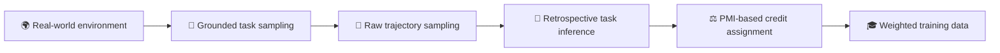

<div align="center">

# AgentBrew

### Offline Tool-Use Agent Learning from Raw Real-World Trajectories


</div>

AgentBrew is the official implementation of **“AgentBrew: Offline Tool-Use Agent Learning from Raw Real-World Trajectories.”** It learns environment-specific tool-use behavior from a single batch of raw trajectories, without task verifiers, simulators, or iterative on-policy rollouts.

AgentBrew first proposes tasks grounded in a live environment and collects raw agent trajectories without quality filtering. It then works fully offline: retrospective task inference reconstructs an instruction aligned with what each trajectory actually accomplished, while PMI-based credit assignment uses conditional NLL differences to assign fine-grained credit to individual actions.



## ✨ What is included

- **Benchmark evaluation** with environment-specific setup, cleanup, and evaluators.
- **Task sampling** grounded in real GitHub, Notion, and PostgreSQL states.
- **Trajectory sampling** with isolated, concurrent workers.
- **Experience distillation** through retrospective task inference and per-action PMI credit.

The current environment implementations are under `agentbrew/environments/{github,notion,postgres}`. Shared execution and distillation code lives in `agentbrew/core` and `agentbrew/experience_distillation`.

## 🚀 Quick start: Notion

### 1. Install the runtime

AgentBrew requires Python 3.10+, Node.js/npm for the Notion MCP server, and an OpenAI-compatible model endpoint.

```bash
python -m venv .venv
source .venv/bin/activate
pip install aiohttp httpx jinja2 mcp notion-client numpy openai \
  playwright psycopg2-binary pydantic python-dotenv pyyaml requests tqdm
playwright install chromium
```

Start your local model server, then update `model_name` and `base_url` in the Notion run configs if they differ from `./Qwen3-32B` and `http://localhost:2024/v1`.

### 2. Configure Notion

Create a local environment file and fill in your own integration keys. Keep this file private.

```bash
cp .env.example .env
```

The benchmark uses one source workspace and one evaluation workspace. The default trajectory configuration uses 10 concurrent workers and therefore expects 10 isolated evaluation integrations. Worker count is controlled by `execution.workers` in `agentbrew/configs/runs/notion_trajectory_sample.yaml`.

Notion page duplication also requires a saved browser session:

```bash
python -m agentbrew.environments.notion.login_helper --browser chromium
```

The default source/evaluation page titles and MCP server settings are defined in `agentbrew/environments/notion/servers.yaml`.

### 3. Run the pipeline

All commands below are run from the repository root.

| Stage | Command | Default output |
|---|---|---|
| 🧪 Benchmark | `bash scripts/run_notion_benchmark.sh` | `outputs/notion_benchmark_local/` |
| 🧰 Task sampling | `bash scripts/run_notion_task_sampling.sh` | `outputs/notion_task_sample/` |
| 🧵 Trajectory sampling | `bash scripts/run_notion_trajectory_sampling.sh` | `outputs/notion_trajectory_sample/trajectories/` |
| ☕ Experience distillation | `bash scripts/run_notion_experience_distillation.sh` | Updates trajectory JSON files in place |

To distill a different trajectory directory, pass it as the first argument:

```bash
bash scripts/run_notion_experience_distillation.sh /path/to/trajectories
```

Use another environment file with `AGENTBREW_ENV_FILE=/path/to/.env`. Benchmark and sampling output locations can be overridden with `--output-root`, for example:

```bash
bash scripts/run_notion_benchmark.sh --output-root outputs/my_notion_benchmark
```

## ⚙️ Run configurations

The YAML files in `agentbrew/configs/runs/` are the reproducible entry points for each workflow. Adjust task sources, model settings, concurrency, timeouts, and output paths there. The generic runner can also be invoked directly:

```bash
python scripts/run.py agentbrew/configs/runs/notion_benchmark.yaml --env-file .env
```

Experience distillation is resumable by default and skips trajectories that already contain complete hindsight and credit metadata. Use `--overwrite` through the Python module when a full recomputation is required.

## 🗂️ Repository layout

```text
agentbrew/
├── agentbrew/
│   ├── configs/runs/              # benchmark and sampling configs
│   ├── environments/              # GitHub, Notion, PostgreSQL
│   └── experience_distillation/   # task inference and credit assignment
├── scripts/                        # runnable examples
└── outputs/                        # generated tasks, traces, and reports
```
